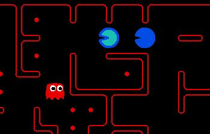

# AI Method 1 - Heuristic Search

# Table of Contents
- [Governing Strategy Tree](#governing-strategy-tree)
  * [Motivation](#motivation)
  * [Application](#application)
  * [Trade-offs](#trade-offs)     
     - [Advantages](#advantages)
     - [Disadvantages](#disadvantages)
  * [Future improvements](#future-improvements)

## Governing Strategy Tree  

### Motivation
We tried implementing a Q-Learning algorithm, but the implementation was unoptimized and performed quite poorly. When playing
against the other models developed by group members, we realized that the heuristic search submitted during
the preliminary phase outperforms the Q-Learning algorithm, so we decided to focus on implementing this algorithm instead.

### Application  
We implemented a bidirectional A* search for the agent's current target. An agent would choose its target based on the game's conditions
and its environment. For example, an agent would attempt to find its way back to the border if an enemy agent is getting too close, to
prevent losing all its food.

We also took advantage of heuristic search's cost function, which allows us to further optimize my model. For example,
we set the cost for eating opponent ghosts to be higher, so that our pacman would go for them if they are in the vicinity.
We also set the cost for running into enemy ghosts (when the agent is a pacman) to get higher based on the distance our agent is to
the opponent. So the agent would attempt to take a path that it 'thinks' is safe, trying to avoid getting close to enemy agent
unless there's a reward that's worth going near an enemy for.

We also implemented a Target Tracker system, so that both the agents are able to communicate with each other on the
food that they are currently going after. This Target Tracker is essentially a class, and the agents both share the same 
instance of it. So an agent would only attempt to go after 'untargeted' foods.

### Trade-offs  
#### *Advantages*  
- Cost function - One of the strengths of heuristic search especially in this problem, is the ability to incorporate costs into every
action. This allows us to handle every possible scenario and drastically improve our agent's decision-making abilities.
- Flexibility - Heuristic search allows us to adapt to different goals at different times, whether that be eating food,
avoiding ghosts, chasing scared ghosts etc. All we have to do is define a current target, and the algorithm would attempt
to accomplish the goal while acknowledging other constraints (due to the costs)
- Admissibility - Because we use Manhattan distance as our heuristic, it ensures that our algorithm would always
find the optimal path, as we'd never overestimate the cost to reach our goal.
#### *Disadvantages*
- Computational cost - Using Q-learning as comparison, Q-learning may have a high computational cost at the start
of the game when we are pretraining our model, but when it comes to decision-making, Q-learning is a lot faster than heuristic search
as we would often have to calculate our paths according to our cost due to the game being so dynamic.

### Future improvements  
Although the agents both start off going after different foods and exploring different paths, at the end of the game when
food becomes scarce, the agents tend to go after the same food, leaving the agent that is slightly slower to waste its time.

As shown in the example above, both agents are going after the same group of food even when there are only 6 food left on the map
and could be easily handled by just one agent.

This model would have a lot more potential if we had implemented food clustering, so agents would specify a cluster of 
food that they are going after, or have it so that when there are only a few foods left to collect and they are close to each other,
one agent could go for the food and the other could play defense. On the other hand, if the food are far from each other, we could
have both agents going after different food to lessen the traversing time for each agent.

Essentially, we probably could have handled the agents' search differently, when the game is almost ending and there aren't much food
left.
[Back to top](#table-of-contents)
