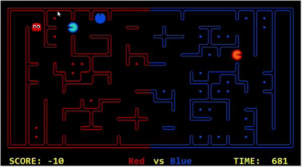
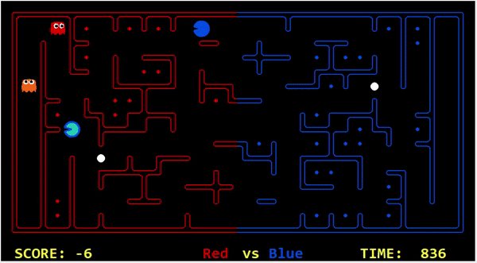

## Challenges  
### Heuristic Search
The biggest challenge that I've had to face was handling agents going after the same food. I implemented a target tracker
system to ensure that the agents don't go after the same food, it works for the most part of the game but towards the end
when the food are almost all eaten, the agents would often take the same path.

This is because I have the agents only communicate about the current food that they are going after, but not the area or 
the cluster of food that they are going after. So towards the end of the game when the food are close together, it'd usually only
require one agent to collect all of the remaining food, but instead both my agents would take the same path and the second agent
would often do nothing productive, as the agent in front would collect all the food by itself.

As shown in this clip, the dark blue and light blue pacmans were at the same region so their food targets were very close,
dark blue was targeting the food that is higher up whereas light blue is targeting the food that is slightly lower. Although
both the pacmans were targeting different food, it was inefficient for them both to go to that region as one pacman would be sufficient.

Another major challenge that is prominent in the heuristic search implementation is that it is extremely difficult to predict
opponent's movements. We can see from this example of light blue agent getting eaten, that despite defining an extremely high cost for
running into an opposing pacman, and even increasing the cost while moving closer towards an enemy pacman, it still decided to take 
that path because it was not considering the opponent's movements. Nevertheless, this constraint is inherent to heuristic search. A lot
of effort has to be put into adjusting the cost, which presents its own set of challenges.

## Conclusions and Learnings